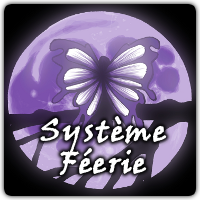
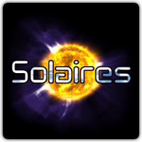

# Bienvenue

Bienvenue sur le réseau Féerie, le site officiel du [Système Féerie](http://systeme.feerie.net), un système de jeu de rôle adaptable. Féerie.net héberge aussi certains projets associés comme [Solaires](http://solaires.feerie.net).

Tout le contenu de ce site (sauf mention contraire) est placé sous la licence Creative Common, Attribution-Non Commercial-Partage avec conditions identique ([page officielle](http://creativecommons.org/licenses/by-nc-sa/3.0/fr/)). Cela signifie plusieurs choses mais principalement : Vous avez parfaitement le droit de copier et de réutiliser ce contenu à condition de citer les sources (ce site et ses auteurs), de ne pas en faire un usage commercial et, si vous le modifiez, vos modifications doivent être distribuées sous cette même licence.

Bonne visite !

>> ### Sommaire
>> 
>> * [Système Féerie](https://systeme.feerie.net)
>> * [Solaires](http://solaires.feerie.net)
>> * [Articles](/articles)
>> * [News](/news)
